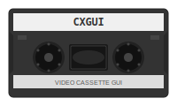

# cxgui

a gui to capture raw files from cxadc-win-tool for use with vhs-decode

| Features         | Description                          |
|------------------|--------------------------------------|
| Capture          | Captures a .u8 file from cxadc0 |
| Capture Timeout  | How long it will capture the tape
| .cxvalues.txt | Saves cxvalues in a txt file in the same folder as capture file  |
| dshow Player     | Plays local dshow device (like Elgato Game Capture, Hauggpuge USB2-Live etc) |
| rtsp Player      | Plays a network rtsp source (like from a go2rtc server) |
| VHS Control      | Lets you control your VHS Player by using a Arduino/Pi with IR transmitter or another service like home assistant if you haved it set up as http reachable webhooks |
| Capture Device (TODO) | select the cx capture device

# Install

* working cxadc driver setup on windows (disabled secure boot, disabled enforced driver signing)
* cxadc-win-tool.exe in same folder as cxgui
* pip3 install python-vlc requests
